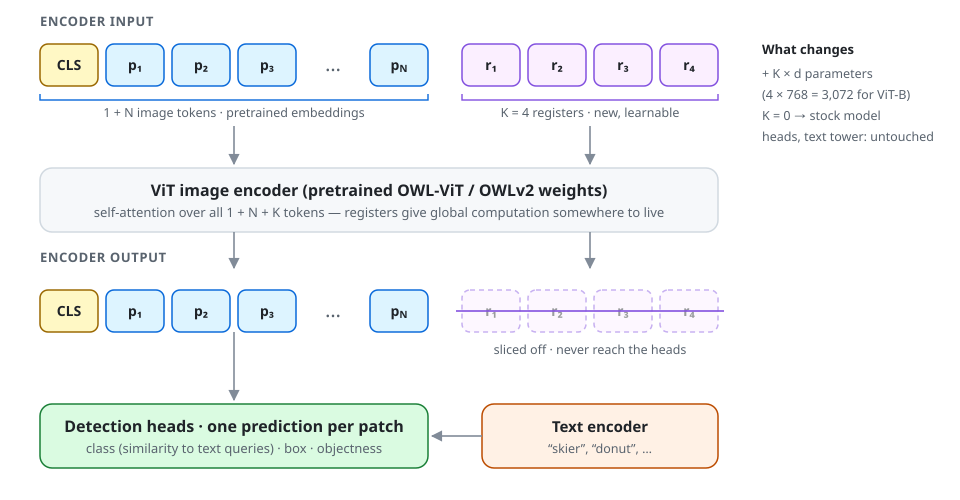
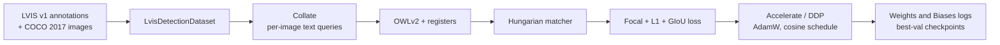
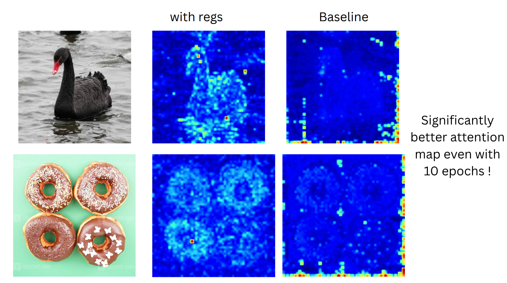
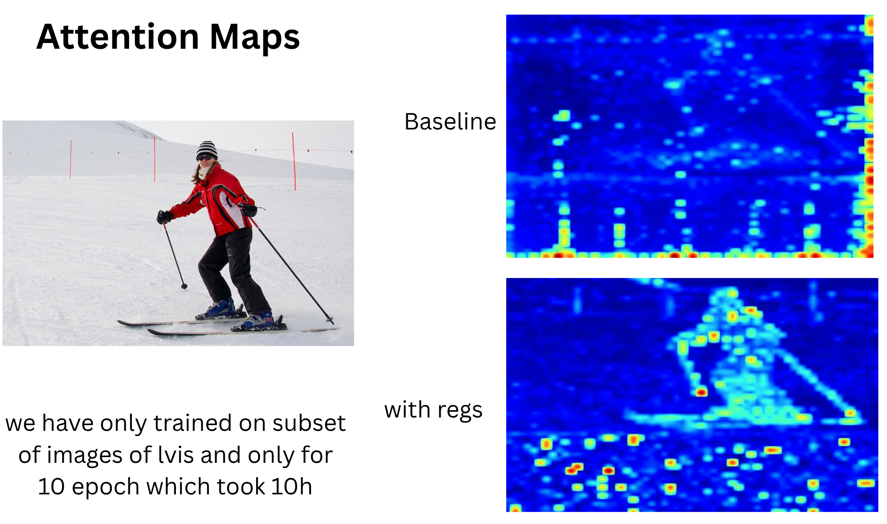

<div align="center">

# OWL-ViT with Registers

**Adding register tokens to an open-vocabulary object detector.**<br>
A Hugging Face Transformers extension, an LVIS fine-tuning pipeline, and attention-map analysis tooling.


[Pratyush Jena](https://github.com/ProtonPratt) · Akshat Shah<br>
<sub>Computer Vision course project · IIIT Hyderabad · Spring 2025</sub>

<br>

<picture>
  <source media="(prefers-color-scheme: dark)" srcset="assets/architecture-dark.svg">
  
</picture>

</div>

## Overview

[OWL-ViT](https://arxiv.org/abs/2205.06230) and [OWLv2](https://arxiv.org/abs/2306.09683) turn a CLIP-style Vision Transformer into an open-vocabulary detector by making **every patch token predict a box and a class**. The quality of individual patch tokens therefore matters directly.

[*Vision Transformers Need Registers*](https://arxiv.org/abs/2309.16588) (Darcet et al., 2023) showed that large ViTs repurpose low-information background patches as scratch space for global computation, which leaves high-norm artifact tokens in the feature map. Their remedy is to append a few extra learnable tokens, called *registers*, that give the model somewhere else to do that work.

This project asks what happens when you put the two together: **can registers be retrofitted onto a pretrained open-vocabulary detector, and what do they do to its attention?**

What is in this repository:

- **A register-enabled OWL-ViT / OWLv2**, written as subclasses of the Hugging Face model and config classes and designed so that pretrained checkpoints load unchanged.
- **A detection fine-tuning pipeline** for LVIS: a DETR-style Hungarian matching loss written from scratch, multi-GPU training with Accelerate, and Weights & Biases logging.
- **Analysis tooling**: side-by-side CLS-to-patch attention maps, COCO-style mAP evaluation, and detection overlays.

> [!NOTE]
> This is a research prototype from a one-semester course project. [Project status](#project-status) lists what has been verified and what is still open, including an integration bug that affects how the attention figures below should be read.

## Method

### Register tokens

The whole modification lives in the vision tower's forward pass ([`modeling_owlvit_with_registers.py`](transformers/src/transformers/models/owlv2/modeling_owlvit_with_registers.py)):

```python
# [CLS, p_1 ... p_N]  ->  [CLS, p_1 ... p_N, r_1 ... r_K]
registers = self.registers.expand(batch_size, -1, hidden_size)
encoder_input = torch.cat([embedding_output, registers], dim=1)

encoder_outputs = self.encoder(inputs_embeds=self.pre_layernorm(encoder_input), ...)

# Registers take part in every attention layer, then are dropped.
last_hidden_state = encoder_outputs[0][:, :original_num_tokens, :]
```

| Design choice | Why |
| --- | --- |
| Registers are **appended** after the patch tokens | The first `1 + N` positions keep their meaning, so the pretrained position embeddings and everything downstream that indexes patch tokens stay valid. |
| Registers get **no position embedding** | They are image-independent memory slots, not locations. |
| Outputs are **sliced back to `1 + N`** before leaving the vision tower | The box, class and objectness heads still see exactly one token per patch. No head needs to change. |
| `num_registers = 0` builds the **stock model** | One code path covers both the baseline and the experiment. |
| Truncated-normal initialisation | Standard deviation is the config's `initializer_range`, the same scale as the rest of the model. |

The cost is `K × d` new parameters, which is 3,072 for four registers on a ViT-B backbone. At 960 × 960 input and patch size 16 the encoder already handles 3,600 patch tokens, so four more add about 0.1% to the sequence length.

### Fitting into Hugging Face Transformers

`Owlv2VisionConfigWithRegisters` and `Owlv2ConfigWithRegisters` subclass the upstream configs and add a single field, `num_registers`. The model classes reuse the upstream embeddings, encoder, text tower and detection heads, and replace only the vision transformer.

Because the new modules sit inside the `transformers/models/owlv2/` package and declare `__all__`, the library's lazy import structure picks them up automatically:

```python
from transformers import Owlv2ConfigWithRegisters, Owlv2ForObjectDetectionWithRegisters

config = Owlv2ConfigWithRegisters.from_pretrained(checkpoint_dir, num_registers=4)
model = Owlv2ForObjectDetectionWithRegisters.from_pretrained(
    checkpoint_dir, config=config, ignore_mismatched_sizes=True
)
```

The intent is that a pretrained checkpoint loads unchanged and the register parameter is the only tensor initialised from scratch.

## Training pipeline



**Open-vocabulary batching.** Hugging Face's OWL-ViT classes ship without a training loss, so the pipeline supplies its own. For each image the collate function builds the list of text queries from that image's ground-truth categories and remaps the labels to indices into that list, which is the form OWL-ViT's per-query logits expect.

**Loss** ([`loss.py`](loss.py)). Predictions are matched one-to-one to ground-truth boxes with the Hungarian algorithm, then scored with three terms:

```math
\mathcal{L} = \lambda_{\text{cls}}\,\mathcal{L}_{\text{focal}} + \lambda_{\text{L1}}\,\mathcal{L}_{\text{L1}} + \lambda_{\text{GIoU}}\,\mathcal{L}_{\text{GIoU}},
\qquad \lambda = (1,\ 5,\ 2)
```

The matcher uses the same `(1, 5, 2)` weights for its cost matrix, and each term is normalised by the number of ground-truth boxes in the batch.

**Default configuration** ([`train_reg_acc_loss.py`](train_reg_acc_loss.py)):

| Setting | Value |
| --- | --- |
| Register tokens | 4 |
| Optimiser | AdamW, learning rate 1e-5, weight decay 0.01 |
| Schedule | Cosine with 500 warm-up steps |
| Batch size | 16 per GPU |
| Epochs | 10 |
| Gradient clipping | Max norm 1.0 |
| Focal loss | α = 0.25, γ = 2.0 |
| Validation | Every 400 steps; best checkpoint kept by validation loss |
| Backbone | Optionally frozen with `--freeze_backbone` |

## Attention maps

[`visualize_attention.py`](visualize_attention.py) loads two checkpoints, runs the same randomly sampled validation images through both, and saves the last-layer CLS-to-patch attention averaged over heads. A gamma of 0.4 lifts the low end so faint structure stays visible.

<p align="center">
  
</p>
<p align="center">
  
</p>

<p align="center"><sub>
Slides from the project presentation. "Baseline" is the OWLv2 checkpoint that fine-tuning starts from. "with regs" is the checkpoint from the 10-epoch run on an LVIS subset, which took about 10 hours.
</sub></p>

**What the baseline shows.** The CLS token's attention is concentrated in a thin band of tokens along the bottom and right edges, and the objects themselves are barely visible. A few tokens absorbing most of the attention mass is consistent with the artifact pattern the registers paper describes.

**What the second checkpoint shows.** Attention follows object outlines: the swan's neck and body, each of the four donuts, the skier and both poles.

**Reading the maps.** OWLv2 pads every image to a square on the bottom and right with flat grey before resizing to 960 × 960, and the script stretches the full 60 × 60 token grid back over the original image. For the landscape skier image, roughly the lower third of each map is therefore padding rather than snow. The edge band also appears on the near-square swan and donut images, so padding is not the whole explanation.

> [!IMPORTANT]
> These figures compare two checkpoints. They should not yet be read as a measurement of what registers do. With the code as committed, the OWLv2 detector's forward pass does not go through the register tokens (see the first item under [Known issues](#known-issues)), so the difference between the two columns has another cause that has not been isolated.

## Project status

### Verified

Checked by running both model variants on small randomly initialised configurations:

- The register-enabled vision tower grows the sequence from `1 + N` to `1 + N + K` tokens inside the encoder and returns `1 + N` tokens.
- In the **OWL-ViT** variant, the detection model routes through the registers end to end: attention maps have `1 + N + K` columns, the heads still emit one prediction per patch, and the register parameter receives gradient.

### Known issues

1. **Registers are bypassed in the OWLv2 detection wrapper.** `Owlv2ForObjectDetectionWithRegisters` assigns the register-enabled model to `self.owlvit`, a name carried over from the OWL-ViT version. The inherited OWLv2 forward pass reads `self.owlv2`, so it runs the stock vision tower and the register parameter never receives gradient. The training, evaluation and visualisation scripts all use this class. The fix is to assign to `self.owlv2`, drop the key-renaming workaround in `eval2_coco.py`, and let `visualize_attention.py` accept `K` extra tokens.
2. **Box targets are not normalised.** `train_reg_acc_loss.py` passes LVIS boxes in absolute `[x, y, w, h]` pixels to a loss that expects normalised `[cx, cy, w, h]`. `train_reg_acc_loss2.py` adds the conversion but reads the image size from variables that are never set.
3. **`--freeze_backbone` will freeze the registers too** once item 1 is fixed, because they are parameters of the vision tower. They need to be excluded from the freeze to be trained on a frozen backbone.
4. **No mAP is reported.** The COCO-style evaluation harness is in place, but no numbers from it are published here.
5. **Small scale.** Training ran for 10 epochs on a subset of LVIS (the script defaults point at 10-class annotation files). The script that builds the subset is not in the repository.

### Next steps

- Fix items 1 to 3 and retrain, with the registers as the only trainable backbone parameters.
- Regenerate the attention maps as a three-way comparison: starting checkpoint, fine-tuned without registers, fine-tuned with registers. That separates the effect of fine-tuning from the effect of registers.
- Report mAP on the LVIS subset for all three, and sweep the number of registers.

## Repository layout

```text
.
├── transformers/                      Hugging Face Transformers fork (4.52.0.dev0)
│   └── src/transformers/models/owlv2/
│       ├── configuration_owlvit_registers.py    Owlv2ConfigWithRegisters
│       └── modeling_owlvit_with_registers.py    Owlv2ForObjectDetectionWithRegisters
│
├── configuration_owlvit_registers.py  First prototype, on OWL-ViT
├── modeling_owlvit_with_registers.py
├── owlv2/                             Snapshot of the model package with a later revision of that prototype
│
├── train_dataset.py                   LvisDetectionDataset
├── loss.py                            Hungarian matcher, focal + L1 + GIoU loss
├── train_reg_acc_loss.py              Training: Accelerate, matching loss, W&B
├── train_reg_acc_loss2.py             Same, with box normalisation in progress
├── train_register_val.py              Earlier single-GPU iterations with a placeholder loss
├── train_register_val1.py
│
├── eval2_coco.py                      Distributed COCO-style evaluation of fine-tuned checkpoints
├── evaluate_owlv2_coco_acceleratev1.py   Earlier evaluation script
├── visualize_attention.py             Attention-map comparison between two checkpoints
├── visualize_detections.py            Predicted and ground-truth box overlays
├── print_checkpoint_keys.py           Inspect state-dict keys of a checkpoint
│
├── results/                           Attention-map figures
├── assets/                            README diagrams
├── CV_Project_Proposal.pdf            Original project proposal
│
├── owl_vit/                           Reference: Google's OWL-ViT implementation (Scenic, JAX)
└── Vit-RGTS-main/                     Reference: a third-party ViT-with-registers implementation
```

Only two files inside `transformers/` are new. The rest of that directory, `owl_vit/` and `Vit-RGTS-main/` are upstream code kept for reference under their own licences.

## Getting started

### Install

```bash
git clone https://github.com/ProtonPratt/Owl-Vits-with-Registers.git
cd Owl-Vits-with-Registers

pip install -e ./transformers      # the fork that provides the *WithRegisters classes
pip install -r requirements.txt
```

### Data and weights

The scripts read everything from local paths:

```text
train2017/  val2017/                      COCO 2017 images
lvis/lvis_v1_train_10cls.json             LVIS v1 annotations, filtered to the training classes
lvis/lvis_v1_val_10cls_filtered.json
checkpoint_small/                         A local OWLv2 checkpoint in Hugging Face format
```

Full LVIS annotation files work too. Pass them with `--train_ann_file` and `--val_ann_file`.

### Train

```bash
accelerate launch train_reg_acc_loss.py \
  --model_name_or_path ./checkpoint_small \
  --num_registers 4 \
  --train_ann_file ./lvis/lvis_v1_train_10cls.json --train_image_dir ./train2017 \
  --val_ann_file ./lvis/lvis_v1_val_10cls_filtered.json --val_image_dir ./val2017 \
  --output_dir ./owlvit_registers_lvis_finetuned \
  --batch_size 16 --num_epochs 10 --learning_rate 1e-5
```

Pass `--wandb_project ""` to turn off Weights & Biases logging.

### Evaluate

```bash
accelerate launch eval2_coco.py \
  --finetuned_checkpoint_dir ./owlvit_registers_lvis_finetuned/checkpoint-epoch-10-best \
  --base_model_config_path ./checkpoint_small \
  --ann_file ./lvis/lvis_v1_val_10cls_filtered.json --image_dir ./val2017 \
  --num_registers 4 --num_eval_images 500
```

### Visualise attention

```bash
python visualize_attention.py
```

Checkpoint and output paths are constants at the top of the script.

## References

- Minderer et al., [*Simple Open-Vocabulary Object Detection with Vision Transformers*](https://arxiv.org/abs/2205.06230), ECCV 2022. OWL-ViT.
- Minderer et al., [*Scaling Open-Vocabulary Object Detection*](https://arxiv.org/abs/2306.09683), NeurIPS 2023. OWLv2.
- Darcet et al., [*Vision Transformers Need Registers*](https://arxiv.org/abs/2309.16588), ICLR 2024.
- Carion et al., [*End-to-End Object Detection with Transformers*](https://arxiv.org/abs/2005.12872), ECCV 2020. The matching loss follows DETR.
- Gupta et al., [*LVIS: A Dataset for Large Vocabulary Instance Segmentation*](https://arxiv.org/abs/1908.03195), CVPR 2019.

## Acknowledgements

Built on [Hugging Face Transformers](https://github.com/huggingface/transformers). Box utilities and the matcher are adapted from [DETR](https://github.com/facebookresearch/detr), and the loss design follows Google's [Scenic OWL-ViT](https://github.com/google-research/scenic/tree/main/scenic/projects/owl_vit) implementation.
